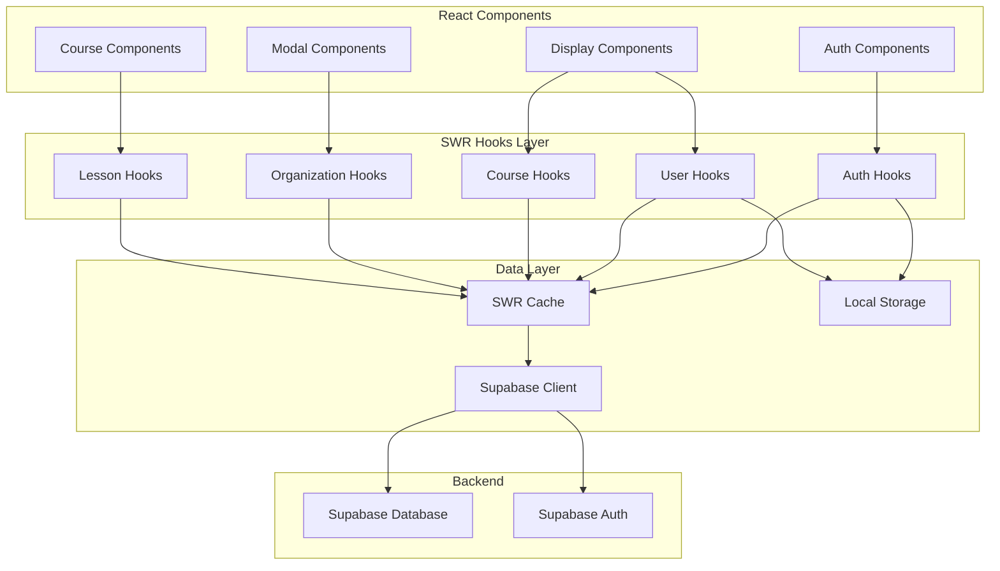
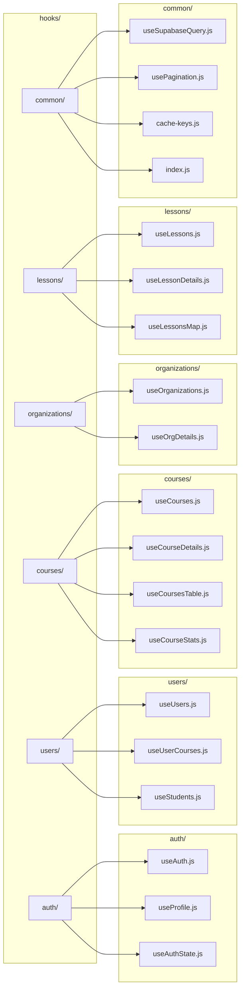
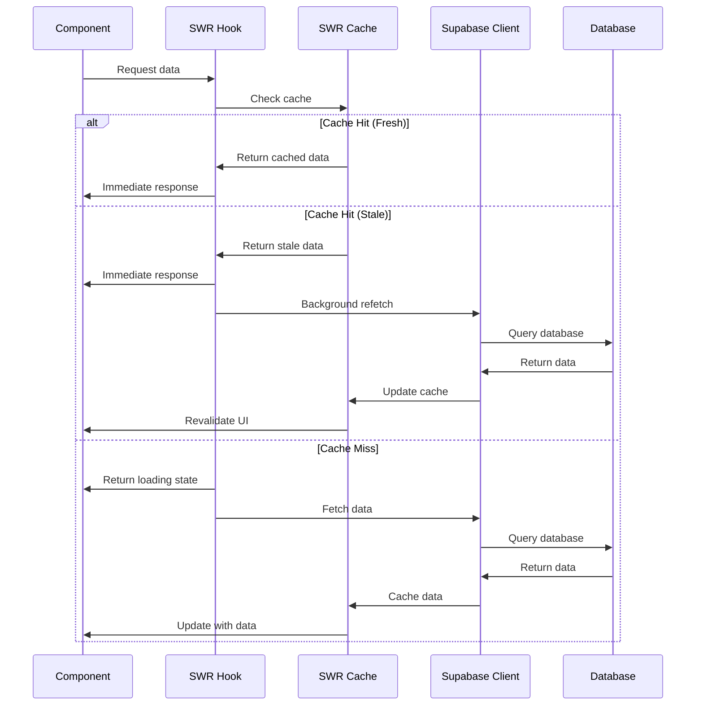
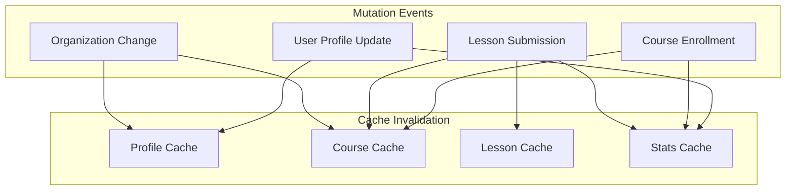
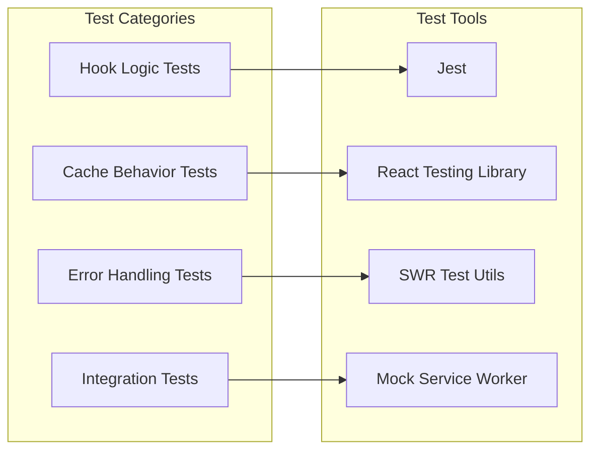
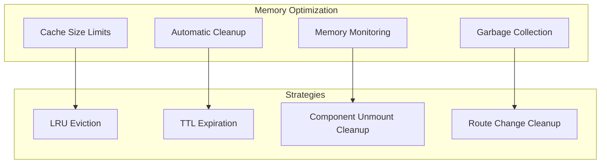
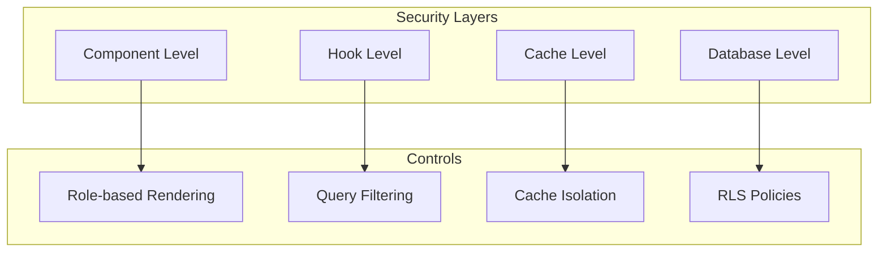
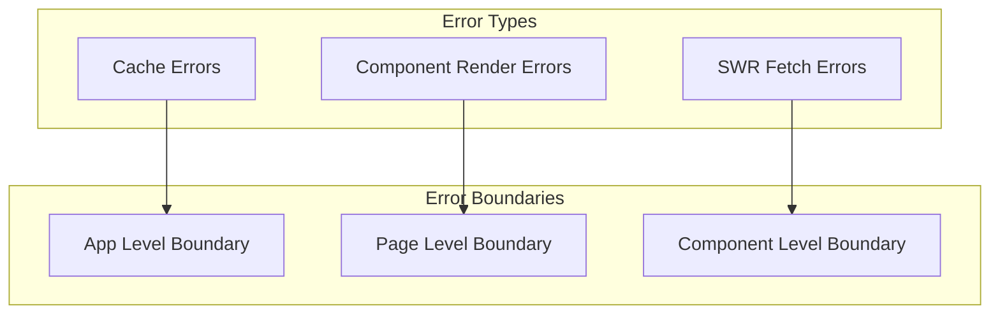

# SWR Hooks Manager Design

## Overview

This design document outlines the implementation of SWR (Stale-While-Revalidate) library integration into the extcourse educational platform to optimize data fetching, reduce duplicate server requests, and improve user experience through intelligent caching strategies.

The current application makes numerous direct Supabase database calls across components, leading to duplicate requests and suboptimal performance. This implementation will create a centralized hooks system that provides caching, background updates, and error handling while maintaining the existing Supabase integration.

## Technology Stack & Dependencies

### New Dependencies
- **swr**: ^2.3.0 - Core SWR library for data fetching and caching
- **@supabase/ssr**: ^0.0.10 - Server-side rendering support for Supabase (optional enhancement)

### Integration Points
- **Supabase Client**: Existing `@supabase/supabase-js` integration
- **React**: Hooks-based implementation compatible with React 19
- **Next.js**: App Router compatible implementation

## Architecture

### SWR Integration Architecture



### Hook Categories Organization



## Component Architecture

### SWR Provider Setup

```mermaid
graph TB
    subgraph "App Structure"
        A[app/layout.js]
        B[SWRProvider]
        C[app/[lang]/layout.js]
        D[Page Components]
    end
    
    A --> B
    B --> C
    C --> D
    
    subgraph "SWR Configuration"
        E[Global Config]
        F[Cache Strategies]
        G[Error Handling]
        H[Revalidation Rules]
    end
    
    B --> E
    B --> F
    B --> G
    B --> H
```

### Hook Interface Design

| Hook Category | Primary Purpose | Cache Strategy | Key Features |
|---------------|----------------|----------------|--------------|
| **Auth Hooks** | User authentication state | Session-based | Real-time auth state, profile caching |
| **User Hooks** | User management & profiles | User-scoped | Pagination support, search caching |
| **Course Hooks** | Course data & enrollment | Course-scoped | Optimistic updates, state transitions |
| **Organization Hooks** | Organization management | Org-scoped | Multi-tenant support, role-based access |
| **Lesson Hooks** | Lesson progress & content | Lesson-scoped | Progress tracking, content caching |

### Data Flow Architecture



## Hook Implementation Specifications

### Authentication Hooks

#### useAuth Hook
- **Purpose**: Centralized authentication state management
- **Cache Key**: `auth-session`
- **Revalidation**: On focus, on auth events
- **Features**: Auto-refresh, logout handling, role detection

#### useProfile Hook
- **Purpose**: Current user profile management
- **Cache Key**: `profile-${userId}`
- **Revalidation**: On profile updates
- **Features**: Profile editing, role changes, organization switching

### User Management Hooks

#### useUsers Hook
- **Purpose**: Admin user management with pagination
- **Cache Key**: `users-${page}-${search}-${roleFilter}`
- **Revalidation**: On user actions, periodic refresh
- **Features**: Search, filtering, bulk operations, pagination

#### useStudents Hook
- **Purpose**: Student data management for supervisors
- **Cache Key**: `students-${page}-${search}-${orgId}`
- **Revalidation**: On enrollment changes
- **Features**: Course progress tracking, lesson status

### Course Management Hooks

#### useCourses Hook
- **Purpose**: Course listing and management
- **Cache Key**: `courses-${page}-${filters}`
- **Revalidation**: On course state changes
- **Features**: Status filtering, organization filtering, student assignment

#### useCourseDetails Hook
- **Purpose**: Individual course information
- **Cache Key**: `course-${courseId}-${userId}`
- **Revalidation**: On lesson completion, status updates
- **Features**: Progress tracking, lesson management, enrollment status

#### useCourseStats Hook
- **Purpose**: Course statistics and analytics
- **Cache Key**: `course-stats-${courseId}-${userId}`
- **Revalidation**: Daily, on lesson completion
- **Features**: Progress metrics, time tracking, completion rates

### Lesson Management Hooks

#### useLessons Hook
- **Purpose**: Lesson data and progress management
- **Cache Key**: `lessons-${courseRefId}-${profileId}`
- **Revalidation**: On lesson submissions, status changes
- **Features**: Status tracking, content loading, submission handling

#### useLessonsMap Hook
- **Purpose**: Lesson status overview mapping
- **Cache Key**: `lessons-map-${courseRefId}-${profileId}`
- **Revalidation**: On any lesson status change
- **Features**: Quick status lookup, progress indicators

### Organization Hooks

#### useOrganizations Hook
- **Purpose**: Organization management and selection
- **Cache Key**: `organizations-active`
- **Revalidation**: On organization changes
- **Features**: Multi-tenant support, organization switching

## Caching Strategy

### Cache Key Structure

| Data Type | Cache Key Pattern | TTL | Revalidation Triggers |
|-----------|------------------|-----|---------------------|
| **Authentication** | `auth-${sessionId}` | Session lifetime | Auth state changes |
| **User Profiles** | `profile-${userId}` | 30 minutes | Profile updates |
| **Course Lists** | `courses-${orgId}-${filters}` | 5 minutes | Course state changes |
| **Lesson Data** | `lessons-${courseId}-${userId}` | 1 hour | Lesson submissions |
| **Organizations** | `orgs-active` | 1 hour | Organization changes |
| **Statistics** | `stats-${type}-${id}-${date}` | 24 hours | Data updates |

### Cache Invalidation Strategy



### Optimistic Updates

| Operation | Optimistic Strategy | Rollback Condition |
|-----------|-------------------|-------------------|
| **Profile Updates** | Immediate UI update | Server validation failure |
| **Course Enrollment** | Add to course list | Enrollment rejection |
| **Lesson Status** | Status badge update | Submission failure |
| **Organization Switch** | Context change | Permission denied |

## Testing Strategy

### Unit Testing Approach



### Test Coverage Requirements

| Component | Test Type | Coverage Target | Key Test Cases |
|-----------|-----------|----------------|----------------|
| **SWR Hooks** | Unit | 90%+ | Data fetching, error states, cache behavior |
| **Cache Logic** | Unit | 95%+ | Key generation, invalidation, TTL handling |
| **Error Handling** | Unit | 100% | Network errors, auth failures, data validation |
| **Integration** | E2E | 80%+ | Complete user flows, cache consistency |

### Mock Strategy

- **Supabase Client**: Mock all database operations
- **Authentication**: Mock user sessions and role changes
- **Network Requests**: Mock with consistent response patterns
- **Cache State**: Test cache hit/miss scenarios

## Performance Optimization

### Bundle Size Optimization

- **Tree Shaking**: Import only necessary SWR functions
- **Code Splitting**: Lazy load hooks by feature area
- **Bundle Analysis**: Monitor SWR impact on bundle size

### Memory Management



### Performance Metrics

| Metric | Target | Measurement Method |
|--------|--------|-------------------|
| **Initial Load Time** | < 500ms | Web Vitals monitoring |
| **Cache Hit Rate** | > 80% | SWR devtools |
| **Background Update Time** | < 200ms | Performance API |
| **Memory Usage** | < 50MB | Browser DevTools |

## Migration Strategy

### Phase 1: Foundation Setup
1. Install SWR dependencies
2. Create basic hook structure
3. Implement SWR provider
4. Setup cache configuration

### Phase 2: Authentication Migration
1. Migrate auth state management
2. Replace direct Supabase auth calls
3. Implement profile caching
4. Test authentication flows

### Phase 3: Core Data Migration
1. Migrate user management hooks
2. Replace course data fetching
3. Implement lesson management
4. Add organization support

### Phase 4: Optimization & Testing
1. Implement optimistic updates
2. Add comprehensive error handling
3. Performance optimization
4. Complete test coverage

### Backward Compatibility

- Maintain existing Supabase client exports
- Gradual component migration
- Feature flags for rollback capability
- Parallel implementation during transition

## Security Considerations

### Data Security

- **Row Level Security**: Maintain Supabase RLS policies
- **Authentication**: Preserve existing auth mechanisms
- **Cache Security**: No sensitive data in client cache
- **API Keys**: Secure environment variable handling

### Access Control



## Error Handling Strategy

### Error Categories

| Error Type | Handling Strategy | User Experience | Recovery Action |
|------------|------------------|-----------------|-----------------|
| **Network Errors** | Retry with backoff | Loading state, retry button | Automatic retry |
| **Authentication Errors** | Redirect to login | Auth error message | Force re-authentication |
| **Permission Errors** | Graceful degradation | Limited access notice | Role verification |
| **Data Validation Errors** | Form validation | Inline error messages | User correction |

### Error Boundary Integration



## Monitoring & Analytics

### Performance Monitoring

- **SWR Devtools**: Development debugging
- **Cache Analytics**: Hit rates, miss patterns
- **Performance Metrics**: Load times, update frequencies
- **Error Tracking**: Failed requests, retry patterns

### Key Performance Indicators

| KPI | Measurement | Target | Alert Threshold |
|-----|-------------|--------|-----------------|
| **Cache Hit Rate** | Successful cache retrievals | > 80% | < 70% |
| **Average Response Time** | Time to data resolution | < 300ms | > 500ms |
| **Error Rate** | Failed requests percentage | < 1% | > 3% |
| **Memory Usage** | Cache memory consumption | < 50MB | > 100MB |